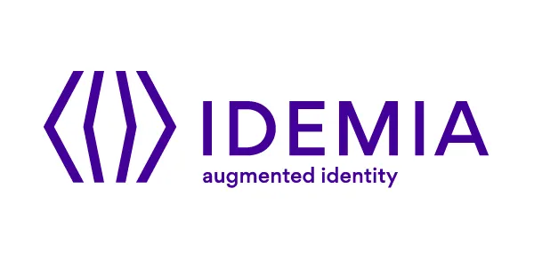
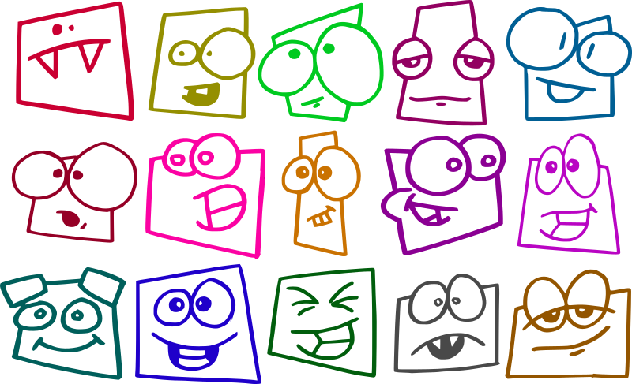
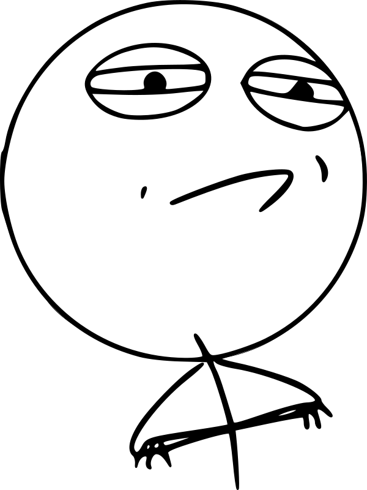

<div align="center">
  <table>
    <tr>
      <td align="center" valign="middle">
        <a href="https://www.telecom-paris.fr/en/home">
          
        </a>
      </td>
      <td width="28"></td>
      <td align="center" valign="middle">
        <a href="https://www.idemia.com/">
          
        </a>
      </td>
    </tr>
  </table>

  <h1>Face Occlusion Estimation</h1>

  <p>
    <strong>Predict how much of a face is hidden from a single cropped image.</strong><br/>
    A computer vision data challenge by
    <a href="https://www.telecom-paris.fr/en/home">Telecom Paris</a> x
    <a href="https://www.idemia.com/">IDEMIA</a>.
  </p>

  <p>
    
    
    
    
  </p>

  <p><em>Serious metric. Tiny chaos. Challenge accepted.</em></p>
</div>


<p align="center">
  
</p>

<p align="center">
  <em>
    Real face crops have a talent for being messy: masks, hair, sunglasses, blur,<br/>
    and one face that clearly knows it is ruining your validation loss.<br/>
    The job sounds simple: one <code>224 x 224</code> crop, one occlusion score. Then the images start having opinions.
  </em>
</p>


## At a Glance

| Item | Details |
|---|---|
| Input | Cropped face image, `224 x 224` |
| Output | Continuous occlusion percentage in `[0, 1]` |
| Task type | Supervised regression |
| Main challenge | Accuracy on hard, highly occluded samples |
| Extra pressure | Balanced performance across female and male subsets |

```text
face crop -> model -> occlusion score
```

Simple to write down. Annoyingly hard to do well.


## What the Model Learns to Notice

The visual clues are often obvious to humans but slippery for machines:

- masks and sunglasses,
- hands, hair, scarves, and hats,
- objects passing in front of the face,
- blur, bad crops, and partial visibility.

The challenge is to learn useful visual cues without overreacting to noisy crops or incidental occlusions — and to do it **without trading one subgroup's performance for another's**.


## Scoring

Highly occluded samples carry more weight, so the benchmark gives extra attention to hard cases.

$$
\mathrm{Err} =
\frac{\sum_{i=1}^{N} w_i (y_i - \hat{y}_i)^2}{\sum_{i=1}^{N} w_i},
\qquad
w_i = \frac{1}{30} + y_i
$$

The final score combines subgroup performance and subgroup balance:

$$
\mathrm{Score} =
\frac{\mathrm{Err}_{\mathrm{female}} + \mathrm{Err}_{\mathrm{male}}}{2}
+
\left|\mathrm{Err}_{\mathrm{female}} - \mathrm{Err}_{\mathrm{male}}\right|
$$

Lower is better. It rewards low overall error, accuracy on highly occluded faces, and balanced
errors across the female and male subsets.


## Approach & Results

The whole project is one idea: **`config + data + split → one self-contained experiment folder`**.
Models are YAML configs, not new scripts — `src/face_occlusion/` is the reusable library, and every
run lands in `outputs/experiments/<id>/` with its config, checkpoints, predictions and reports.

**What we explored** (all config-gated, default off):

- **Backbones** — a fully fine-tuned **ConvNeXt-Small** (our strongest single model) and
  **DINOv2 ViT-B + LoRA**.
- **Metric-aligned & imbalanced-regression losses** — gender-balanced weighted MSE, an ordered-bin
  **expectation head (DEX + DLDL/LDS)**, an ordinal-threshold head, distribution-aware reweighting,
  and a synthetic monotonic-ranking objective.
- **Sampling & augmentation** — a gender×occlusion balanced-batch sampler, background-invariance
  augmentation, and a label-aware synthetic-occlusion pipeline.
- **Fairness for the gender gap** — Deep Feature Reweighting and a gradient-reversal gender adversary.
- **Combining models** — EMA weight averaging and prediction ensembling.

**What worked.** Under a bootstrap-CI gate, no single architectural or loss lever beat a well-tuned
ConvNeXt-Small; the one reliable win came from **ensembling decorrelated, individually-tied models**
(validation ≈ `0.00118`, leaderboard ≈ `0.00112`). The remaining error is **data-bound**: the rare
high-occlusion tail (only ~8 training faces above occlusion `0.6`) and the gender gap resist every
model-side fix, which our analyses trace to scarcity and label noise rather than the model.

> Full method write-ups (one page per component) are in
> [`docs/architecture/`](docs/architecture/README.md).


## Getting Started

1. Install [uv](https://docs.astral.sh/uv/getting-started/installation/).
2. Clone and set up:

   ```bash
   git clone https://github.com/mohammed-elamine/face-occlusion-estimation.git
   cd face-occlusion-estimation
   make install
   ```

3. Train the baseline (each run gets its own folder under `outputs/experiments/`):

   ```bash
   python -m scripts.training.train --config configs/baseline.yaml
   ```

Run `make help` for all commands. The rest of the pipeline — data checks, splits, test prediction,
ensembling, analysis reports and cluster jobs — is in the docs below.


## Documentation

| Topic | Where |
|---|---|
| Project orientation (layout, tools, how to add an experiment) | [`docs/PROJECT_GUIDE.md`](docs/PROJECT_GUIDE.md) |
| Architecture, component by component (the technical reference) | [`docs/architecture/`](docs/architecture/README.md) |
| Method write-ups (the *why*) | [auxiliary learning](docs/occlusion_aware_auxiliary_learning.md), [sampler](docs/balanced_batch_sampler.md), [synthetic occlusion](docs/synthetic_occlusion_generation.md) |
| Running each stage (data / training / inference / analysis) | the `README.md` inside each `scripts/<area>/` |
| Experiments & ablations | [`configs/README.md`](configs/README.md) (baseline + ensemble + experiments) |
| Contributing & dev setup | [`CONTRIBUTING.md`](CONTRIBUTING.md) |


## Project Map

```text
face-occlusion-estimation/
├── configs/                # Experiments as YAML: baseline.yaml + ensemble/ + experiments/ + eval/
├── src/face_occlusion/     # Reusable library: data/ models/ training/ metrics/ inference/ utils/
├── scripts/                # CLI entry points: data/ training/ inference/ analysis/ setup/ runpod/
├── docs/                   # PROJECT_GUIDE + architecture/ (component-by-component) + topic notes
├── tests/                  # pytest suite (uv run pytest)
├── jobs/                   # Slurm job scripts (train.slurm)
├── notebooks/              # EDA & split-diagnostics notebooks
├── data/                   # Local data, git-ignored
├── outputs/                # Experiment folders, splits, logs — git-ignored
└── assets/                 # Challenge logos & illustrations
```


<p align="center">
  
</p>

<p align="center">
  <em>Occlusion? Fairness penalty? Weird crops?</em><br/>
  <strong>Challenge accepted.</strong><br/>
  <sub>
    <a href="https://openclipart.org/detail/319872/funny-faces">faces</a>
    /
    <a href="https://openclipart.org/detail/168636/challenge-accepted">challenge accepted</a>
  </sub>
</p>

## Authors

Built with determination by:

- **Mohammed Elamine** · [elamine.mohammed.14@gmail.com](mailto:elamine.mohammed.14@gmail.com)

<sub>One student vs. occluded faces. What could go wrong?</sub>
